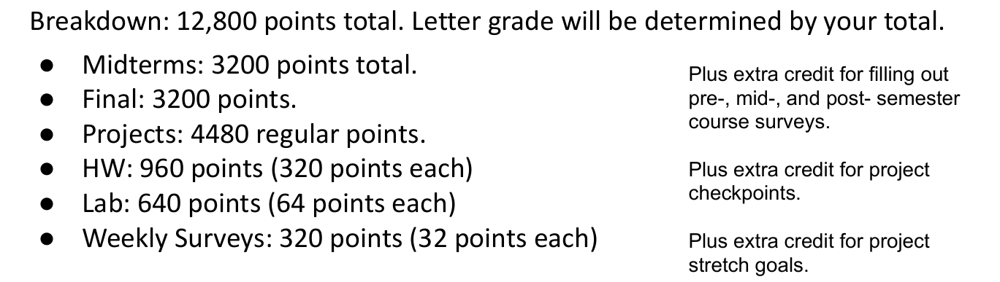

# L01 Intro, Hello World Java

## 关于 CS 61B 课程概述

CS 61B 课程主要是为已经具备编程基础的学生提供更进一步的提升，课程的两大核心目标包括：

1. 编写运行效率更高的代码，即代码执行更快且占用空间更小。
2. 提高编写优质代码的效率，让学生的时间投入更为高效。

为了达到这些目标，课程将涉及大型程序的设计、构建、测试和调试。学生将学习使用多种工具，包括 Git 版本控制系统、IntelliJ 集成开发环境、JUnit 测试框架，以及 Java 编程语言。虽然 Java 学习不是课程的主要焦点，但我们将快速通过其基础内容，因为假设学生已有其他类似语言（如 Python 或 MATLAB）的经验。

## 为何选修 CS 61B

选择学习 CS 61B 的理由多种多样，其中包括：

- **数据结构与算法的普遍应用**：从 Google 的自动完成功能到复杂的游戏算法（如 AlphaGo），再到自动驾驶汽车和先进的 AI 技术（如 GPT），数据结构和算法是推动社会技术进步的关键。
- **科学与仿真**：现代科学越来越依赖于模拟和复杂数据分析，如宇宙星系形成的模拟，这些都需要强大的数据结构和算法支持。
- **程序美学与设计**：好的程序员会关注数据结构及其相互关系而非仅仅是代码本身，这对于提高编程效率和程序性能至关重要。

通过学习 CS 61B，学生不仅能够提升编程技能，还能深入理解数据结构和算法在解决实际问题中的重要性，为将来从事更高级的技术开发和研究打下坚实的基础。

## CS 61B 课程团队与教学哲学

### 课程团队介绍
课程由 Josh Hugg 教授主讲，团队包括许多助教和学术实习生，以支持班上约1700名学生。教学团队致力于为学生提供必要的支持和资源，帮助他们在学习过程中取得成功。

### 教学哲学
Josh Hugg 教授强调，真正的学习来自于实践而非被动接受。他通过分享个人学习跳舞机（Dance Dance Revolution）的经历来说明这一点。教授认为，课堂讲解和阅读材料虽然重要，但真正的理解和学习主要来自于实际操作，包括讨论小组、实验室和项目作业。

### 课程结构与资源
CS 61B 课程网站是学生获取所有课程资源和信息的主要渠道。课程分为三个阶段：

1. **Java 强化入门**：在课程的前几周，将通过浏览器编程作业、实验室活动和项目来快速介绍 Java。
2. **数据结构重点**：这一阶段是为了面试和实习准备，涵盖散列表、二叉搜索树、堆等关键数据结构。这部分包括编程作业、理论作业和一个大型个人项目。
3. **算法与软件工程**：最后阶段将讨论排序算法和软件工程问题，主要集中在一个开放性的项目“构建你的自己的世界”上，学生将有机会自由发挥创造一个2D世界。

### 行政与后勤
课程强调，对于任何行政或后勤问题，学生应通过课程论坛或指定的电子邮件地址联系，而不是直接向教授发送邮件。此外，讨论和实验室的出勤虽然不是必须的，但如果参加，需要开启摄像头，以增强互动和参与感。

## 评分标准与课程要求

### 评分细则
CS 61B 课程的总分为12800分，学生的最终成绩将根据他们累积的分数确定。课程提供了额外的加分机会，例如通过调查问卷、项目检查点以及在项目中实现超出基本要求的目标来获得额外积分。尽管课程中有某种程度的分数调整（例如最终考试成绩的部分调整），但教授力求保持评分标准的稳定性，确保学生的成绩反映其个人努力和成就。

### 作业与项目提交
CS 61B 课程不接受任何延迟提交的作业或项目。学生需要在截止日期之前提交所有作业，逾期未提交将无法获得分数。课程中设置有“滑动日”（slip days），用于在特殊情况下延长提交时间，但一旦用尽，任何超过截止时间的作业都不会被接受。

### 课程开始与预备作业
课程从一开始就将以快节奏推进。教授强调，学生应在第一节实验室课和讲座之前完成“作业零”，这是关于 Java 基础语法的入门作业，预计需要1到4小时完成。这项作业旨在帮助学生将之前的编程知识迁移到 Java 上，如果学生发现这项作业极具挑战性，可能需要重新考虑是否适合继续学习 CS 61B。

### 项目零与Java基础
“项目零”将在课程开始的第一周发布，并要求学生在下一个星期五之前完成。这个项目不仅要求学生掌握 Java 的基本功能，还包括一个算法上的挑战，即实现游戏2048的核心算法。对于不熟悉 Java 的学生，教授建议尽早开始项目，以便有足够的时间在需要时寻求助教的帮助。

## Java与Python编程基础对比

### 程序结构比较

在介绍Java的基本结构时，教授通过同时展示Python和Java的编程示例来突出两种语言的不同。在Python中，打印"Hello World"仅需要一行代码，而在Java中，则需要定义一个类和主方法，显示Java相对更为繁琐但也更结构化的特点。

### Java的严格结构

Java要求所有的代码必须位于某个类之中，并且每个语句末尾必须有分号。这些规则使得Java非常适合大型软件项目的开发，因为它们促进了代码的整洁和组织性。此外，Java的错误信息提供了关于代码问题的具体指导，帮助程序员快速定位和解决问题。

### 类型系统

Java是一种静态类型语言，这意味着所有变量在使用前都必须声明其类型。这与Python的动态类型形成对比，后者允许变量在运行时改变类型。Java的这一特性可以提前捕捉到类型错误，防止程序运行时突然崩溃，但这也意味着Java代码更加冗长，并可能需要定义多个版本的函数来处理不同类型的数据。

### 函数和方法

在Java中，函数被称为方法，必须声明在类内部，这反映了Java的面向对象编程范式。每个方法不仅需要声明参数类型，还必须指定返回类型。这与Python的函数定义相比，Java的方法定义更为严格和详细。

### 示例代码：打印数字序列

教授展示了在Python和Java中打印从0到9的数字序列的代码。在Java中，实现相同功能需要更多的设置，如显式声明变量类型以及使用大括号来明确代码块的开始和结束。这种详细程度虽然增加了代码量，但也使得Java代码的执行更为可预测和安全。

通过对比Python和Java的编程实例，可以看出Java在项目管理和错误预防方面的优势，尤其适用于大型和复杂的软件开发项目。然而，这种严格的结构和类型系统也使得Java代码比Python更为冗长和复杂，这可能会在某些情况下增加开发的难度和时间。

## Java编程入门总结及实践强调

### Java的对象导向特性

Java是一种强对象导向语言，要求所有的代码都必须在类中定义。这包括变量声明、方法定义等。入门级的Java程序通常从定义一个包含`main`方法的类开始，这是Java应用程序的标准入口点。

### Java的静态类型系统

Java中的每个变量、参数和方法都需要声明其类型，且一旦声明，类型不可改变。这种静态类型系统在编译时进行类型检查，有助于捕捉错误，提高代码的安全性和效率。相对于动态类型语言，这使得Java代码更易于阅读和维护，尽管这也意味着代码更加冗长，并可能需要定义不同版本的方法来处理不同类型的数据。

### 效率与通用性的权衡

虽然静态类型系统增加了代码的冗长性，但它也使得Java程序在运行时更加高效，因为不需要在运行时进行类型检查。这对于大型软件项目特别有利，因为它可以减少运行时错误和性能问题。

### 实践与作业

为了帮助学生熟悉Java编程，课程设置了“作业零”和“项目零”，这些作业和项目让学生有机会实践Java编程，解决实际问题。教授强调，通过实际编写和运行代码，学生可以更好地理解和吸收Java的概念和语法。

### 课程资源与工具

课程推荐使用IntelliJ IDE进行Java开发，以利用其强大的功能帮助编码、调试和测试。教授还提醒学生，所有课程相关的资料和通知都将通过课程网站发布，并鼓励学生积极参与课程论坛的讨论。
