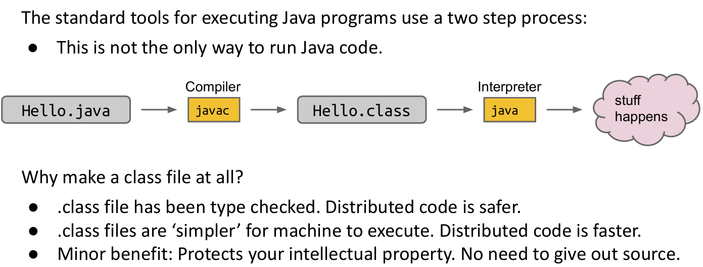
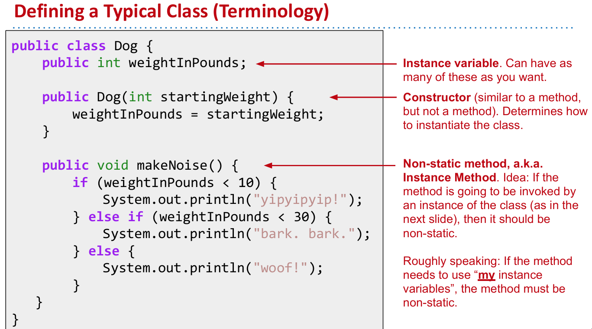
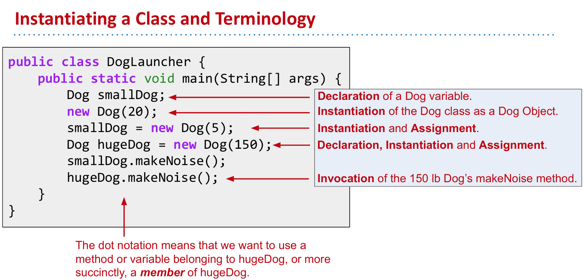
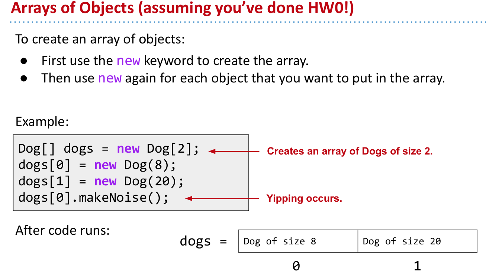
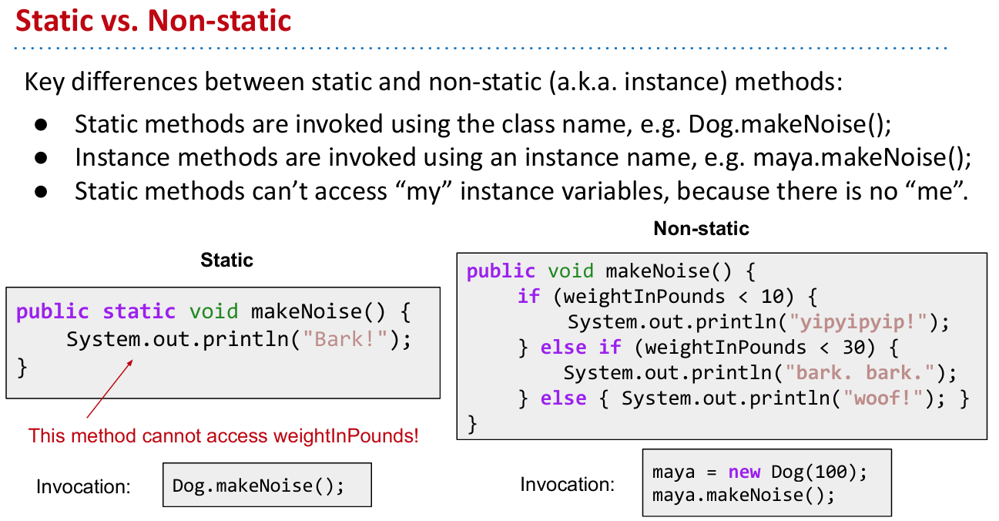
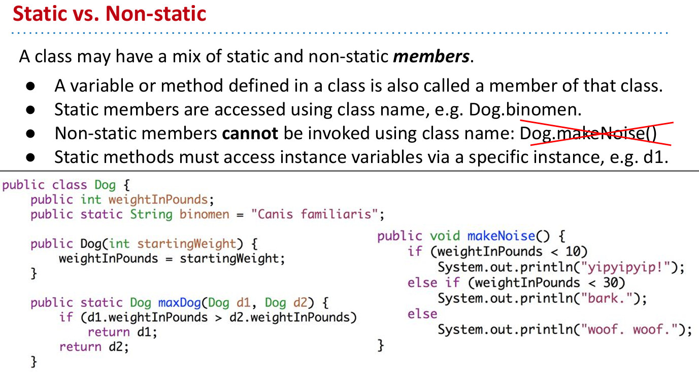

# L02 Defining and Using Classes

## 运行Java程序的多种方法

在Java中，有许多运行程序的方法。本课程中，我们将重点介绍一种更通用的工作流程，即通过操作系统的终端来执行程序。我们不会深入探讨Windows、Mac OS或Linux的终端使用细节，假设你已经有一定的使用经验。如果你将来要进行大量编程工作，熟悉操作系统终端将非常有用。

## Java程序的编译和运行

通常，编译和运行Java程序的基本方式如下：首先，在一个文件夹中，使用`ls`命令列出当前的文件，发现有一个名为`helloworld.java`的文件（上节课的）。运行这个文件实际上是一个两步骤的过程。首先输入`javac helloworld`，可以利用Tab键自动完成文件名，按下回车。这时，看似没有任何反应，但如果再次使用`ls`命令，会发现一个新的名为`helloworld.class`的文件出现了。这表示你已经将`.java`文件编译成了`.class`文件，原文件依旧保留。

接下来，如果你想运行`helloworld`，输入`java helloworld`（注意这里不加`c`，因为`c`表示编译器）然后按回车，程序就会执行其功能，例如输出"Hello World"。如果删除`.class`文件然后尝试运行，就会出现错误，提示找不到`helloworld`类。

## 编译和解释的整体流程

当你运行一个Java程序时，通常的过程是：将`.java`文件交给编译器，编译器生成一个`.class`文件。这个`.class`文件然后可以交给解释器执行，执行的操作可能是打印输出、播放歌曲、删除电脑上的所有文件、重启电脑、发送邮件等。这并不是运行Java代码的唯一方式，但它是最常见的做法。

## 为何使用`.class`文件

生成`.class`文件的一个原因是它已经进行了类型检查。如果你已经了解静态类型，你会知道当我们将应用程序发布给世界时，我们不会提供Java文件，而是提供已经类型检查过的`.class`文件，这样可以保护我们免受类型错误的影响，使我们分发的代码更安全。此外，`.class`文件对于机器来说更简单，更易于执行。这也是为什么编写一个高效解释这类代码的解释器比较困难。最后，由于你没有分发`.java`文件，这在一定程度上保护了你的知识产权，尽管存在将`.class`文件反编译成Java文件的工具，但这不应被视为一种强大的安全措施。

## 类的定义与实例化

我们即将探讨的话题是类的定义和实例化。虽然之前已经进行过这一操作，但这次将实现一个比之前更复杂的版本。假设我们创建了一个名为`Dog`的新类。与以前不同的是，这次我们将去掉主方法（`main`方法），稍后会了解原因。相反，添加一个名为`makeNoise`的方法，其功能是输出"Mark"。像以前一样，这个类可以编译成`dog.class`文件。但如果尝试直接运行`Dog`类，就会因为缺少`main`方法而报错，提示狗不知道如何运行。

### 类文件与Python的比较

对于熟悉Python的同学，这个Java文件大致相当于一个定义了`makeNoise`函数（输出"Mark"）的Python脚本（`dog.py`）。这个Python程序没有调用`makeNoise`函数，因为它没有`main`函数。类似地，在Python中，不在函数内的代码相当于`main`。

### 主方法的重要性

在Java中，我们创建的类通常不包含`main`方法。例如，在项目零中，我们经常会有其他类使用`Dog`类，而`Dog`类本身不包含`main`方法。这时，我们可以创建一个名为`DogLauncher`的类，它包含`main`方法并负责驱动`Dog`类，演示`Dog`类的功能。在`DogLauncher`的`main`方法中，我们会创建一个`Dog`对象并调用其`makeNoise`方法。

### 使用其他类的方法

`DogLauncher`类的存在表明一个类可以利用另一个类的方法。这是Java编程的一个优点，它允许我们将问题拆解为更小的部分。我们的教科书《Head First Java》将这类用于演示的类称为"test drive"类。

### 多样性的实现

最后，我们要在Java代码中捕捉现实世界的多样性。如果我们正在编写狗的模拟器，我们不希望所有的狗都以相同的方式叫。为此，我们可以为每种狗创建一个单独的类，例如为玛雅（一种狗）创建一个发出“Uru”声音的类，为另一种狗创建一个发出丑陋叫声的类。这种方法虽然可行，但很快就会变得冗余和繁琐。

## Java类中的数据和功能

在Java中，类不仅可以包含函数（方法），还可以包含数据（属性）。这使得类可以作为现实世界实体的蓝图，例如狗。我们可以增强我们的`Dog`类，使其具有如体重等属性，然后将该类实例化为具体的对象进行操作。

## 修改`Dog`类以包含属性

在`Dog`类中，我们不再将其仅视为产生噪音的机器。现在，狗有了一个新属性：体重（以磅为单位）。基于狗的体重，`makeNoise`方法将有不同的行为：体重小于10磅的狗发出“yip”声，体重小于30磅的狗“bark”，而更重的狗则“woof”。

## 遇到的编译问题和解决方法

当尝试编译包含非静态变量体重的`Dog`类时，编译器报错，因为从静态上下文中引用了非静态变量。简单的解决方法是删除`static`关键字。这允许我们创建不同体重的狗实例，并根据体重调用合适的`makeNoise`方法。

## 实例化和使用`Dog`类

在`DogLauncher`类中，我们创建了一个`Dog`的实例，并为其设置体重，然后调用`makeNoise`方法。这展示了如何在Java中具体操作一个对象，并根据其属性执行特定行为。

## 构造函数的引入

为了进一步优化，我们引入了构造函数，允许在创建`Dog`实例时直接设置体重。构造函数是一个特殊的方法，用于在创建对象时初始化对象的状态。在这里，构造函数接受一个整数参数，用于设置狗的体重。

## 类和实例方法的区别

在Java中，实例方法（非静态方法）是与具体实例相关联的方法。这意味着它们依赖于实例的属性来执行操作。与此相对，静态方法不依赖于类的实例，而是属于类本身。

## Java中的垃圾回收

在Java中，如果创建了对象实例但没有任何引用指向它，这个对象将被垃圾回收器销毁。在实际编程中，通常会将新创建的实例赋值给一个变量，以确保可以继续使用该实例。

## 在Java中使用对象数组

在项目零中，除了创建对象，你还将学习如何创建对象的数组。这可能对初学者来说稍微有些复杂。创建对象数组的基本步骤是首先使用`new`关键词创建数组本身，此时数组中并没有具体的对象，只是相当于建立了几个空的“狗屋”。然后，你需要在每个“狗屋”中放入一个具体的狗对象。这样，当数组创建完毕后，每个位置上都有一个具体的狗对象，我们可以调用它们的方法。

## 静态方法和实例方法的区别

静态方法使用类名来调用，它们不能访问实例变量，因为它们不依赖于类的具体实例。实例方法则需要通过类的具体实例来调用，能够访问和操作实例变量。静态方法通常用于那些不需要具体实例就可以执行的操作，例如数学计算等。

## 静态方法和实例方法的应用

让我们通过`Dog`类来探索静态和实例方法的应用。假设我们需要比较两只狗的大小。可以使用静态方法来进行比较，这样的方法不依赖于具体的狗实例，而是作为一个全局的比较工具。例如，`Dog.max(d1, d2)`将比较两个狗实例并返回较大的那一个。如果采用实例方法，比如`d1.max(d2)`，则表示让`d1`这只狗来判断自己是否比`d2`大，这种方法将返回比较的结果。

## 静态变量的使用

静态变量是属于类的所有实例共享的变量。例如，所有狗都有相同的科学名`Canis familiaris`。静态变量的访问最好通过类名进行，而不是通过特定的实例。这样做可以避免混淆，更明确地表示这个变量是属于整个类的，而不是某个具体的实例。

## 静态与非静态的混合使用

在实际的编程实践中，一个类可以同时包含静态方法和实例方法，这取决于这些方法的具体应用场景。例如，`Dog`类可能有一个静态方法用来比较两只狗的大小，同时也可能有一个实例方法来判断这只狗是否喜欢某种特定的食物。

## 在Java中进行数组操作和异常处理

本练习的目的是通过具体代码的操作，加深对Java中对象数组的理解以及静态与非静态方法的应用。在本节中，我们将创建一个包含不同大小狗的数组，并通过数组中的每个狗对象与一个参照狗（中等大小的狗）进行比较，决定哪只狗会发出声音。

### 创建和操作狗对象数组

1. **创建单个狗对象**：首先，我们创建几个具体的狗对象，例如`new Dog(5)`，这表示创建一个体重为5磅的狗。
2. **构建狗数组**：随后，我们创建一个狗数组`miniDogs`，该数组初始时填充为`null`，表示这些位置暂时没有存放任何狗对象。
3. **数组赋值**：接下来，我们将之前创建的狗对象分配到数组的不同位置。例如，`miniDogs[0] = smallDog;`将小狗放在数组的第一个位置。

### 使用循环和条件语句进行比较

我们使用循环遍历数组中的每只狗，并将每只狗与中等大小的狗（`mediumDog`）进行比较。这一比较通过一个静态方法`maxDog`完成，该方法接受两个狗对象作为参数，并返回体重较大的狗。

### 处理异常

在数组操作过程中，尤其是在数组的某些位置可能为`null`的情况下，比较操作可能引发异常。例如，如果尝试访问一个为`null`的数组位置并调用其方法，Java将抛出`NullPointerException`。这是因为`null`表示没有任何对象，因此无法调用任何方法。

使用此链接[Java Visualizer (uwaterloo.ca)](https://cscircles.cemc.uwaterloo.ca/java_visualize/#)中的可视化工具查看解决方案

## Java中的类和静态方法的设计哲学

### 类的强制使用

Java语言设计之所以强制使用类，目的是为了减少编程中的选择，从而降低错误的可能性并简化代码管理。在Java中，所有的代码都必须位于某个类中。这种设计通过限制程序员的选择来简化决策过程，使得代码结构更加清晰和统一。

### 静态方法的作用

静态方法在Java中的存在也是为了简化代码的复杂度。静态方法不依赖于类的实例状态，不能使用实例变量，因此它们提供了一种方式来执行那些不需要访问对象状态的操作。例如，数学计算通常不需要依赖于对象的具体状态，因此很自然地使用静态方法来执行。

### 管理复杂性

Java的这些特性——强制使用类和提供静态方法——都是为了管理和减少代码的复杂性。这种设计哲学帮助程序员避免过度复杂的解决方案，从而提高代码的可读性和可维护性。尤其是在初学编程时，理解如何管理复杂性是非常关键的，它是编程课程的核心目标之一。

### Project Zero的实际应用

在Project Zero中，你将面对实际的编程挑战，这些挑战将要求你应用所学的概念来管理和解决复杂的问题。例如，使用辅助方法（helper methods）来分解大问题为多个小问题，是一种有效的技术来降低整体的复杂性。这种方法不仅帮助清晰地定义问题的各个部分，还减少了错误的可能性，并使得代码更加模块化和可管理。

## 练习：largerThanFourNeighbors

让我们通过一个具体的例子来看看这些概念如何实际应用。假设我们有一个数组，包含一系列的狗对象，每个对象都有一个大小属性。我们的任务是找出那些比它们四个最接近的邻居（两个左边的和两个右边的）都大的狗。

这个问题的解决方案涉及到遍历数组并对每个狗进行比较，看它是否比周围的四个邻居大。如果数组的边界导致某个狗没有足够的邻居，我们只比较存在的邻居。

这种类型的问题让你实践将一个复杂的问题分解为更简单的子问题，这是程序设计中管理复杂性的一个重要策略。通过这样的练习，你不仅能够加深对Java语言特性的理解，还能学习如何在实际编程中有效地管理和降低复杂性。

## 设计代码和帮助方法

### 代码设计

1. **迭代和边界处理**：在处理数组和集合时，考虑到边界条件是至关重要的。例如，在`larger than four neighbors`函数中，必须处理数组的开头和结尾，以避免越界错误。

2. **避免复杂性**：简化逻辑和避免不必要的复杂性是设计良好的代码的标志。通过简化条件检查和循环，可以使代码更易于理解和维护。

3. **使用帮助方法**：帮助方法可以将复杂的问题分解为更小、更具体的任务。这不仅有助于组织代码，还使问题变得更易于管理和调试。

### 帮助方法的使用

在`larger than four neighbors`示例中，可以通过以下步骤应用帮助方法：

1. **定义问题**：首先，明确要解决的问题——找出数组中比其四个最近邻居大的狗。

2. **编写帮助方法**：
    - `isBiggestOfFour`：检查给定狗是否比其四个邻居大。
    - `validIndex`：检查索引是否有效，以防止数组越界。

3. **主方法中的应用**：在主方法中，使用这些帮助方法来简化逻辑和提高代码的可读性。例如，通过`isBiggestOfFour`简化比较逻辑，使主方法集中处理如何构建结果数组。

### 调试和测试

调试是检查和修正错误的过程。使用像IntelliJ这样的集成开发环境（IDE）可以利用断点和逐步执行来观察程序的行为，这对于理解代码流和识别问题至关重要。

### 重构和改进

即使初步实现了功能，也可能需要进一步的重构和改进来提高代码的效率和可读性。在实践中，不断评估和优化代码是常态，这有助于提高程序的性能和可维护性。

通过使用帮助方法和其他结构化编程技巧，可以更有效地管理复杂的编程任务，这不仅使代码更加整洁，还提高了开发效率。在Project Zero和其他项目中，深入理解和应用这些原则是非常重要的，它们将帮助你构建更健壮、更可维护的应用程序。